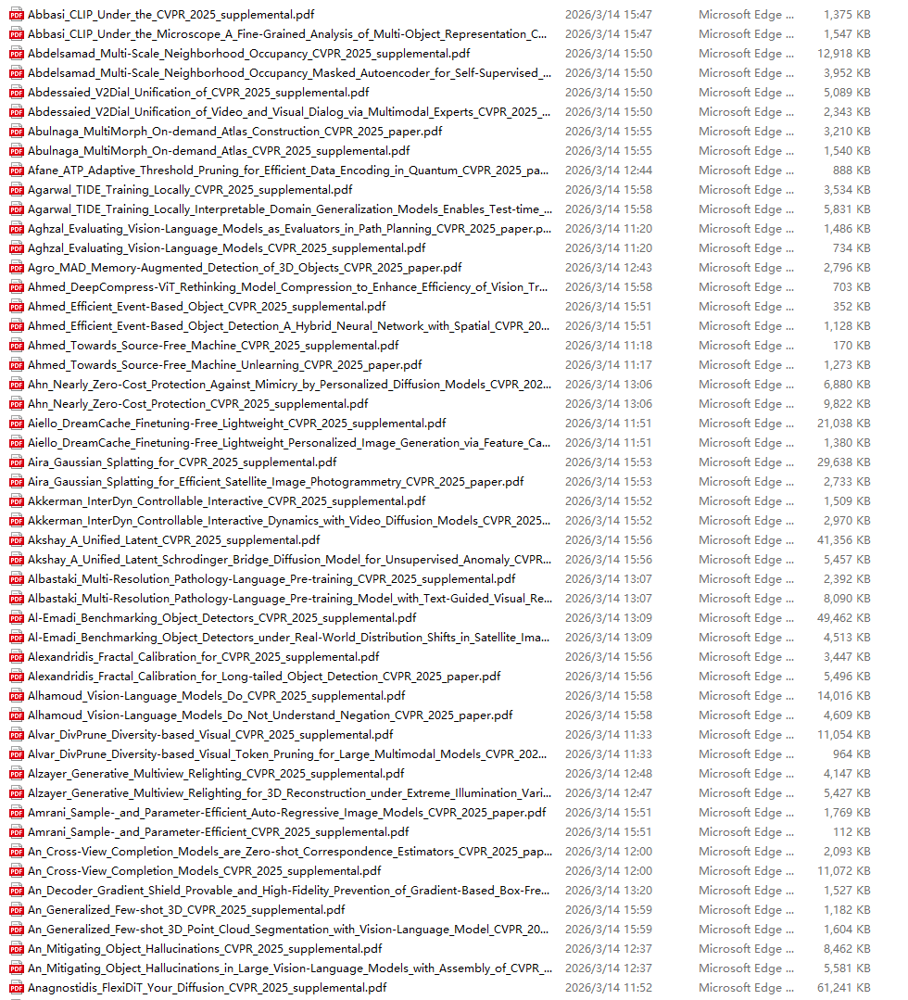
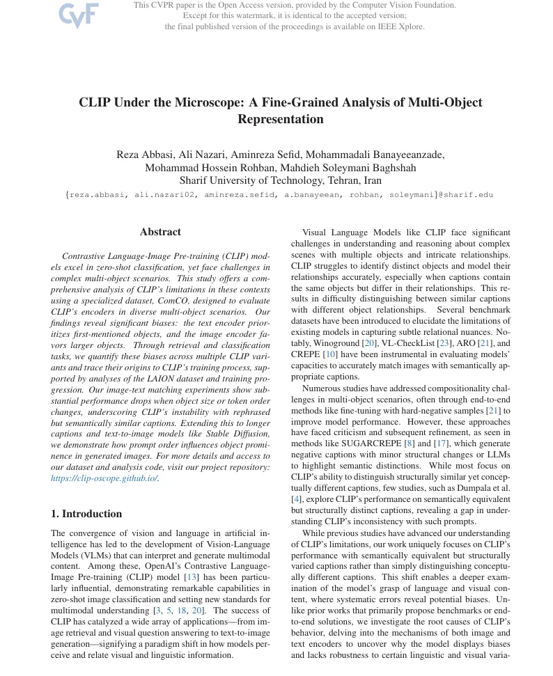
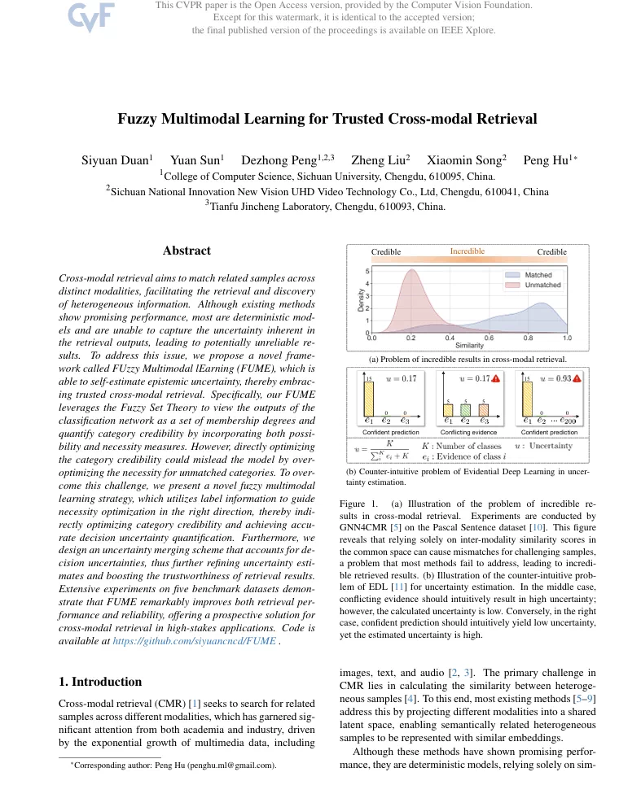
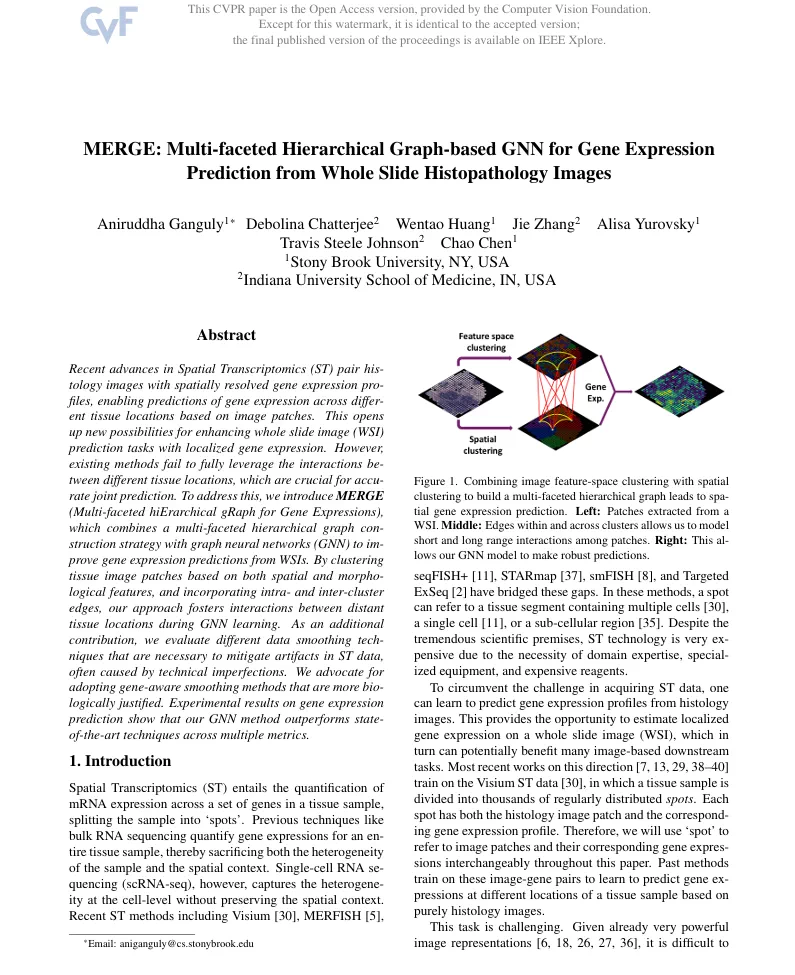
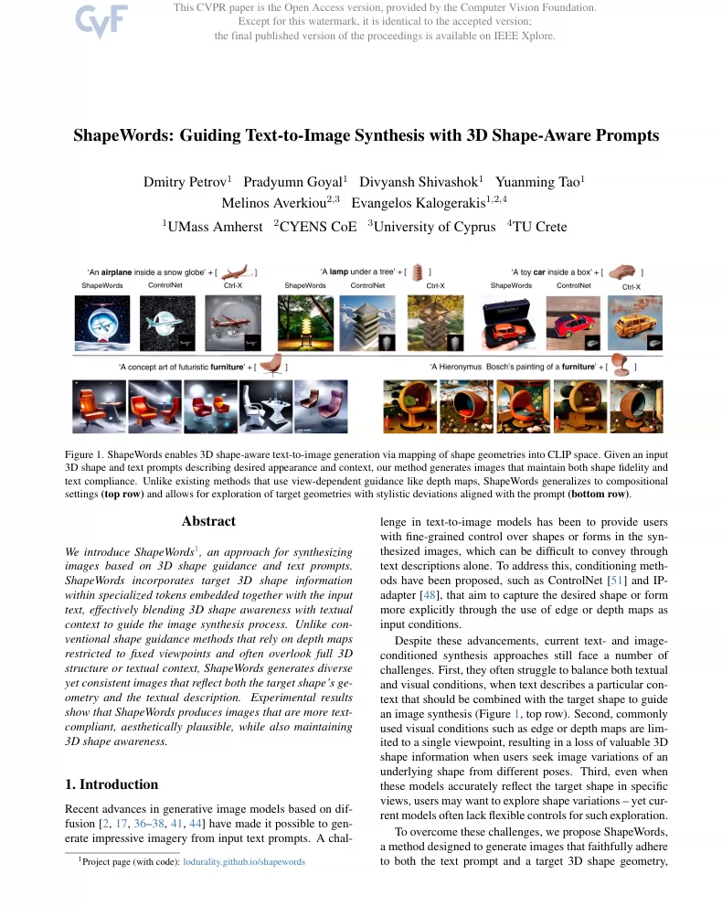

## Body

CVPR 2025 文章合集   一共33.2G

2549篇论文  文件数量共为5098  因为包含 正式发表的核心研究论文  以及 每个正文的补充材料，是正文的配套支撑文档，定位为细节补充与可复现性保障，用于呈现主文中因篇幅限制未展开的技术细节、实现步骤、数据集详情、消融实验补充、代码 / 伪代码等

Transformer 视觉适配、图神经网络（GNN）、轻量化网络设计、自动化网络结构搜索、多目标优化 NAS（精度 / 速度 / 参数量、自监督 / 半监督学习、小样本 / 零样本学习、持续学习、GAN 改进、图像 / 视频生成、风格迁移、对抗攻击与防御、2D/3D 目标检测、视频目标检测、小样本 / 开放世界检测、异常检测、伪装目标检测、语义分割、实例分割、全景分割、视频目标分割......持续更新中

## Images

item_1033002132274

Here is a pay link on Stripe ( https://buy.stripe.com/3cs8yP7sY87d0vu9AB ). Please contact me lonlonago@foxmail.com after funding $89, and I will send you a complete data files , thank you!

